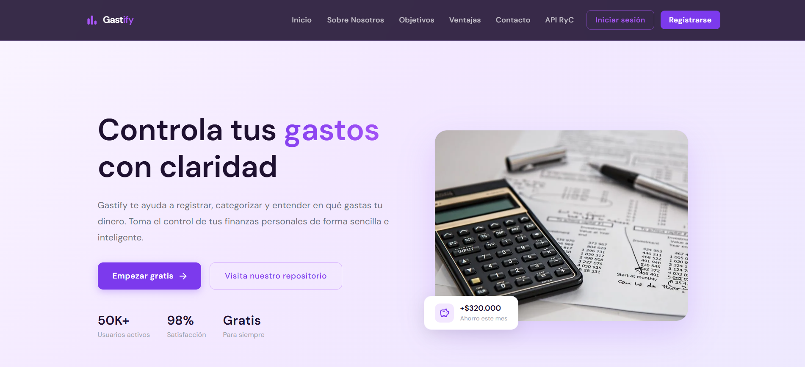
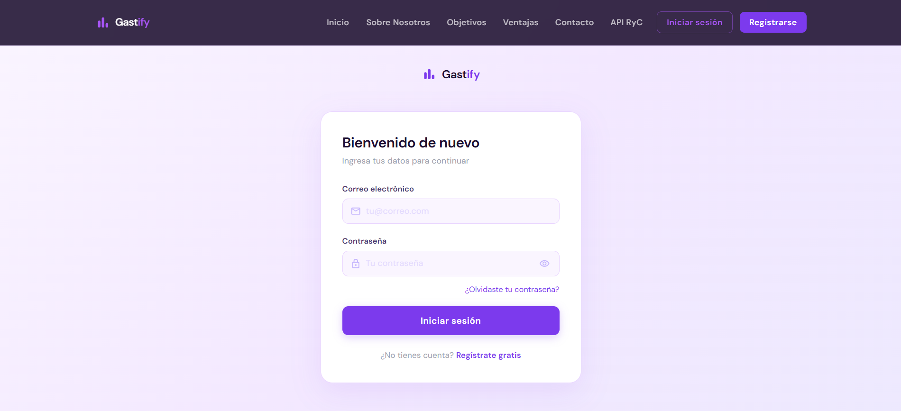
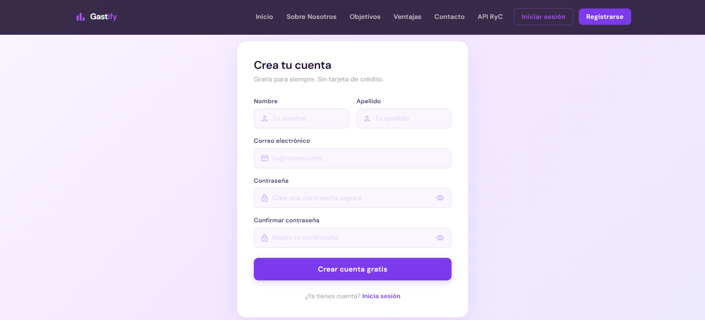
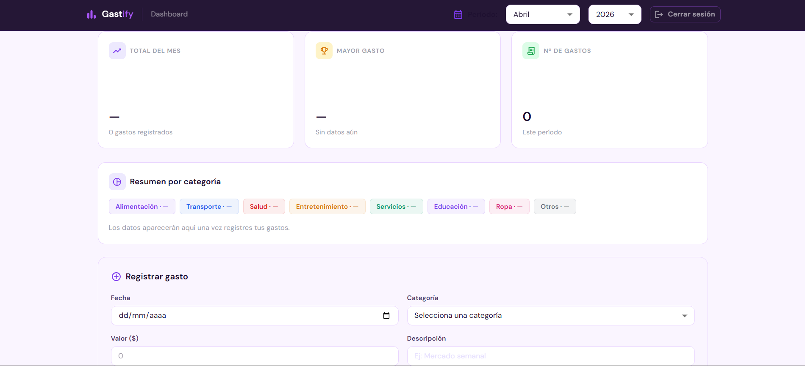

# Gastify 💜

> Aplicativo web PWA para el control y gestión de gastos personales.

## 📋 Descripción

**Gastify** es un aplicativo web progresivo (PWA) desarrollado con el stack **MERN** y arquitectura **Feature Based**, diseñado para que cualquier persona pueda registrar, organizar y visualizar sus gastos personales de forma sencilla e intuitiva.

El proyecto incluye una landing page informativa, un sistema de autenticación funcional con JWT y un dashboard donde el usuario podrá gestionar sus gastos una vez se conecte completamente al backend.

---

## ✨ Características principales

- 🏠 **Landing page** con secciones: inicio, sobre nosotros, objetivos, ventajas y contacto
- 🔐 **Autenticación funcional**: registro e inicio de sesión conectados a MongoDB
- 🔑 **"Olvidé mi contraseña"**: disponible en diseño, pendiente de implementación
- 📊 **Dashboard de gastos** con resumen mensual, formulario de registro y tabla de movimientos
- ✅ **Validaciones en frontend** en todos los formularios
- 📱 **Diseño responsive** para móvil, tablet y escritorio
- 🔒 **Rutas protegidas** con PrivateRoute — solo accesibles con sesión activa
- 📲 **PWA** — instalable como aplicación en dispositivos móviles y escritorio
- 🏗️ **Arquitectura Feature Based** — código organizado por funcionalidad

---

### 🎬 Apartado API Rick y Morty
- ✅ Integración con API pública de Rick y Morty
- ✅ Búsqueda de personajes
- ✅ Visualización de detalles del personaje
- ✅ Paginación de resultados
- ✅ Práctica de consumo de APIs externas

---

## 🛠️ Tecnologías

### Frontend
| Tecnología | Uso |
|---|---|
| React 18 | Librería principal de UI |
| MUI v7 | Componentes y sistema de diseño |
| React Router DOM v6 | Navegación y rutas protegidas |
| Axios | Peticiones HTTP al backend |
| Vite | Bundler y servidor de desarrollo |
| PWA (Vite Plugin) | Funcionalidad de aplicación progresiva |

### Backend — MERN Stack
| Tecnología | Uso |
|---|---|
| MongoDB Atlas | Base de datos en la nube |
| Express | Framework del servidor REST |
| React | Interfaz de usuario (frontend) |
| Node.js | Entorno de ejecución del servidor |
| Mongoose | ODM para MongoDB |
| bcryptjs | Encriptación de contraseñas |
| JSON Web Token | Autenticación basada en tokens |
| dotenv | Variables de entorno |
| cors | Control de acceso entre orígenes |

---

## 📁 Arquitectura del proyecto — Feature Based

```
backend/
├── models/
│   └── Usuario.js              # Modelo de usuario
├── routes/
│   └── auth.routes.js          # Rutas de autenticación
├── .env                        # Variables de entorno
├── index.js                    # Punto de entrada
├── package.json
└── package-lock.json

gestionApp/
├── src/
│   ├── features/               # Características (Feature-Based)
│   │   ├── auth/
│   │   │   ├── components/
│   │   │   │   ├── Login.jsx
│   │   │   │   ├── Register.jsx
│   │   │   │   ├── ForgotPassword.jsx
│   │   │   │   └── PrivateRoute.jsx
│   │   │   ├── hooks/
│   │   │   ├── pages/
│   │   │   └── services/
│   │   │       └── AuthService.js
│   │   │
│   │   ├── dashboard/
│   │   │   ├── components/
│   │   │   │   ├── ExpenseForm.jsx
│   │   │   │   ├── ExpenseSummary.jsx
│   │   │   │   ├── ExpenseTable.jsx
│   │   │   │   └── Searchbar.jsx
│   │   │   ├── hooks/
│   │   │   │   └── UseDashboard.jsx
│   │   │   ├── pages/
│   │   │   │   └── Dashboard.jsx
│   │   │   └── services/
│   │   │
│   │   ├── layout/
│   │   │   ├── components/
│   │   │   │   ├── Header.jsx
│   │   │   │   ├── Footer.jsx
│   │   │   │   └── Content.jsx
│   │   │   ├── hooks/
│   │   │   └── pages/
│   │   │
│   │   └── shared/
│   │       ├── components/
│   │       │   └── Characters.jsx
│   │       ├── hooks/
│   │       │   └── UseApiRyC.jsx
│   │       ├── pages/
│   │       │   └── ApiRyC.jsx
│   │       └── services/
│   │           └── RickAndMortyService.js
│   │
│   ├── public/
│   ├── App.jsx
│   ├── AppRoutes.jsx
│   ├── main.jsx
│   └── index.html
│
├── .gitignore
├── eslint.config.js
├── package.json
├── package-lock.json
├── vite.config.js
└── README.md

```

---

## ⚙️ Instalación y ejecución

### Requisitos previos
- Node.js v18 o superior
- npm
- Cuenta en [MongoDB Atlas](https://www.mongodb.com/atlas)

### 1. Clona el repositorio

```bash
git clone https://github.com/laulp-15/gastify.git
```

### 2. Configura y ejecuta el backend

```bash
cd backend
npm install
```

Crea el archivo `.env` dentro de `backend/`:

```env
PORT=5000
MONGO_URI=tu_uri_de_mongodb_atlas
JWT_SECRET=tu_clave_secreta_larga
```

Inicia el servidor:

```bash
node index.js
```

Si todo está bien verás:
```
✅ Conectado a MongoDB
🚀 Servidor corriendo en http://localhost:5000
```

### 3. Configura y ejecuta el frontend

```bash
cd gestionApp
npm install
npm run dev
```

La app estará disponible en `http://localhost:5173`

> ⚠️ **Importante:** el backend debe estar corriendo antes de usar el registro o inicio de sesión.

---

## 🖥️ Screenshots

### Landing page


### Inicio de sesión


### Registro


### Dashboard


---

## ⚠️ Estado del proyecto

| Funcionalidad | Estado |
|---|---|
| Landing page | ✅ Completo |
| Registro de usuario | ✅ Funcional |
| Inicio de sesión | ✅ Funcional |
| Olvidé mi contraseña | 🎨 Solo diseño |
| Dashboard — diseño | ✅ Completo |
| Dashboard — CRUD de gastos | 🚧 En desarrollo |
| Conexión gastos a MongoDB | 🚧 Pendiente |

---

## 👩‍💻 Autora

**Laura Ulloa**  
Aprendiz de Análisis y Desarrollo de Software — SENA

---
